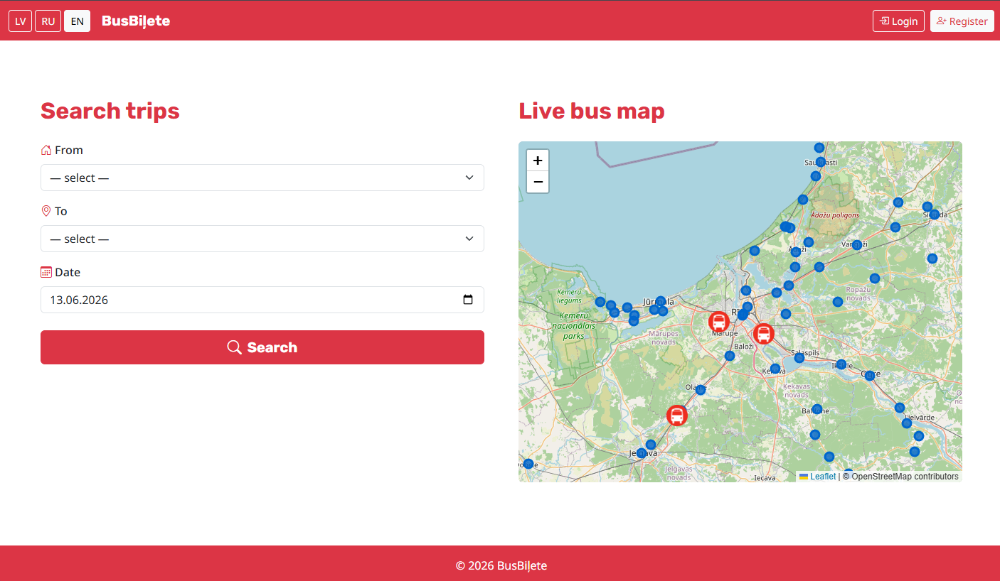
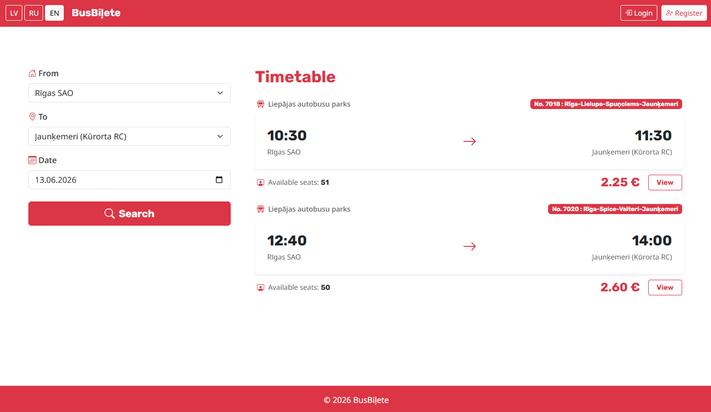
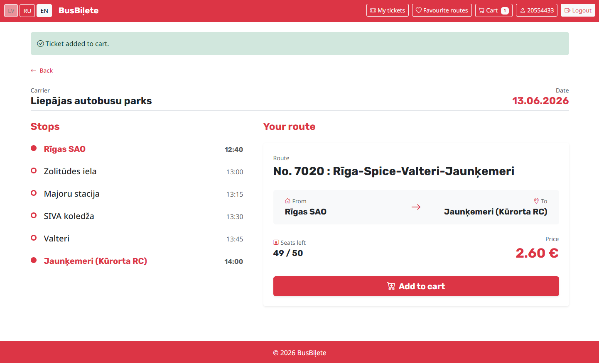
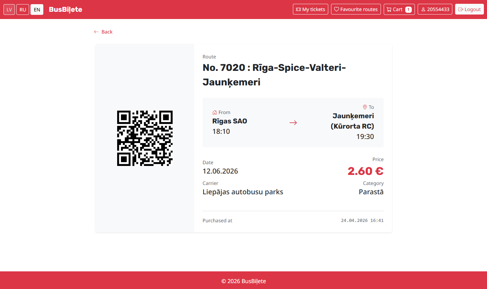
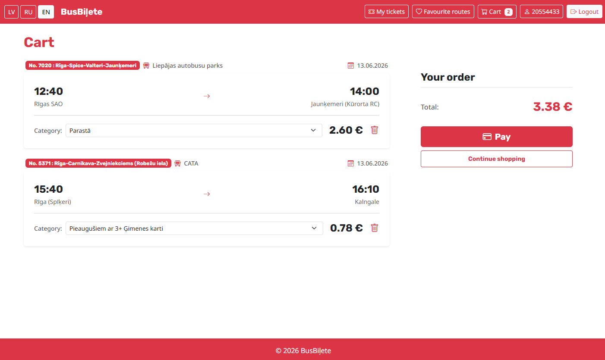

# BusBiļete

A simple [website](https://busbilete-production.up.railway.app) for viewing intercity bus routes in Latvia and purchasing tickets.

> The website is supposed to show real trips, prices and GPS locations through integration with transport companies, but in this project some data was collected manually and hardcoded in the database for testing purposes. For example, trips were created only for June 12, 13 and 14, 2026.

## What was implemented?

* 🌐 Language selection
* ☎️ Registration by phone number
* 🗺️ AJAX map of buses and stops
* 🚌 Trip search and adding favorite routes
* 🛒 Ticket cart
* 💳 Checkout
* 🎟️ Generating a QR code for a ticket _(based on UUID)_
* 🛡️ Admin dashboard with soft deletes

## Tecnhologies used

The system is written in **PHP 8.4** with the **Laravel 13.4** framework, using MVC approach. Data is stored in a **MySQL** database. Payments are processed through the **Stripe** sandbox. The **Leaflet** library is used to display the map. The QR code generators works through a **Simple QrCode** wrapper.

## Screenshots

Home page:

Timetable:

Trip info:

Ticket info:

Cart:

## Test credentials

This account has purchased tickets and added favorite routes:

Phone number: `20554433` 
Password: `@parolefisj` 

This account has admin rights:

Phone number: `29457632` 
Password: `@Administrator123`

____

Created by [@comradewinnie](https://github.com/comradewinnie) in June 2026.